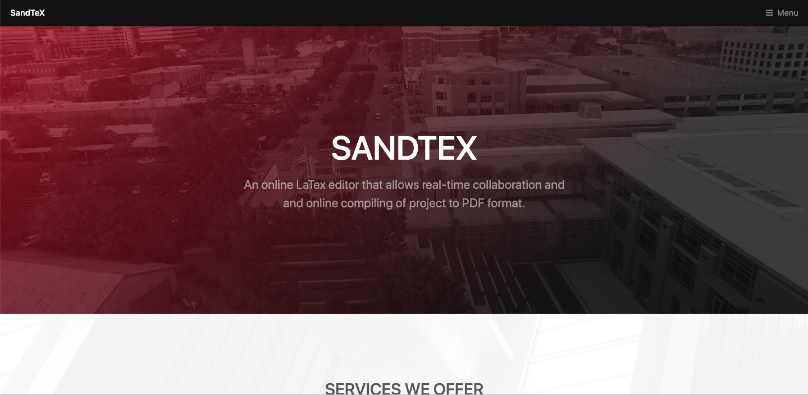
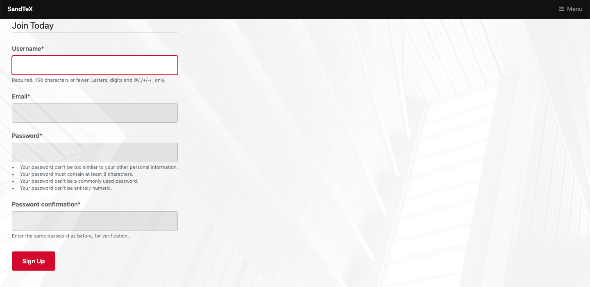
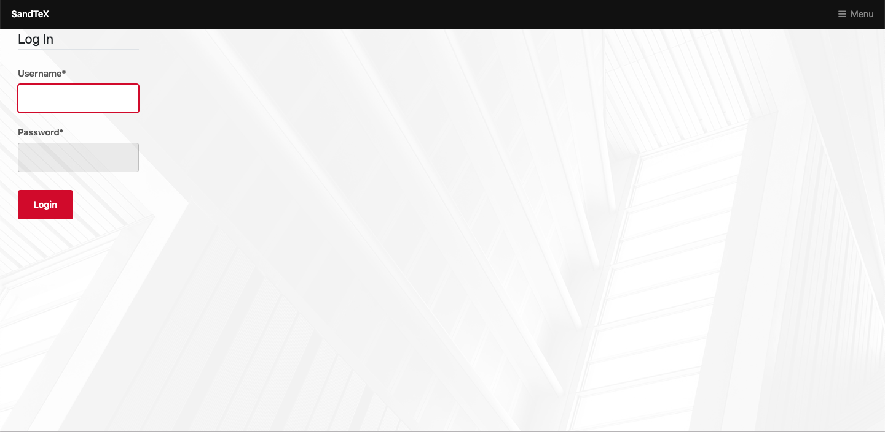
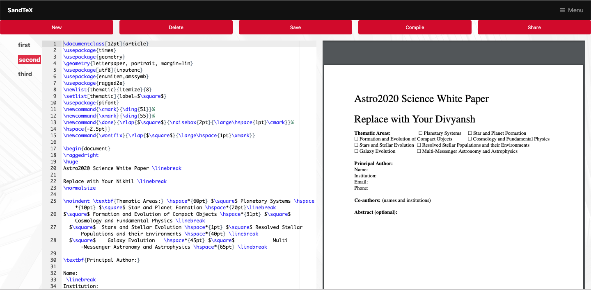
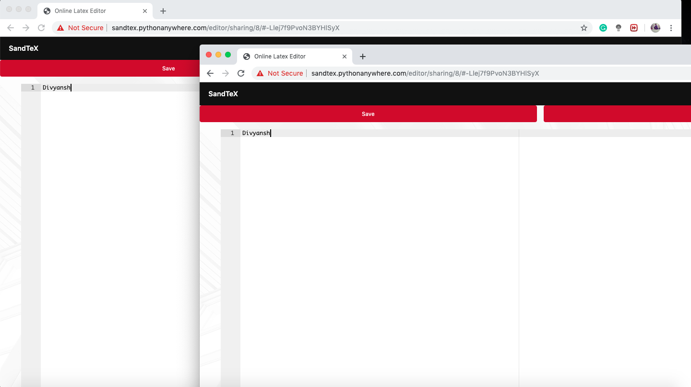

[](https://python.org)
[](https://djangoproject.com)

# SandTex

## SANDTEX - An online Latex Compiler
This is an website which gives advantage to user for compiling latex file and obtaining output pdf file on same window. This website also removes the headache of finding supported operating system and other specification everything is already covered in website you just have to register and login thenm, everything will be done by us. This webiste also provide real time collaboration so that more than one user can work on same file simultaneousely.  

## Running the Project Locally

First, clone the repository to your local machine:

```bash
git clone https://github.com/9916103020/SandTex.git
```

Install the requirements:

```bash
pip install -r requirements.txt
```

Apply the migrations:

```bash
python manage.py migrate
```

Collect the Static folder files:

```bash
python manage.py collectstatic
```

Finally, run the development server:

```bash
python manage.py runserver
```

# Some Snippets of the running project 

## HOME PAGE



## REGISTRATION PAGE



## LOGIN PAGE



## EDITOR PAGE



## REAL-TIME COLLABORATION PAGE



## NOTE: Till Now this website works fine in local sysytem but on pythonanywhere there are some bugs to resolve.
